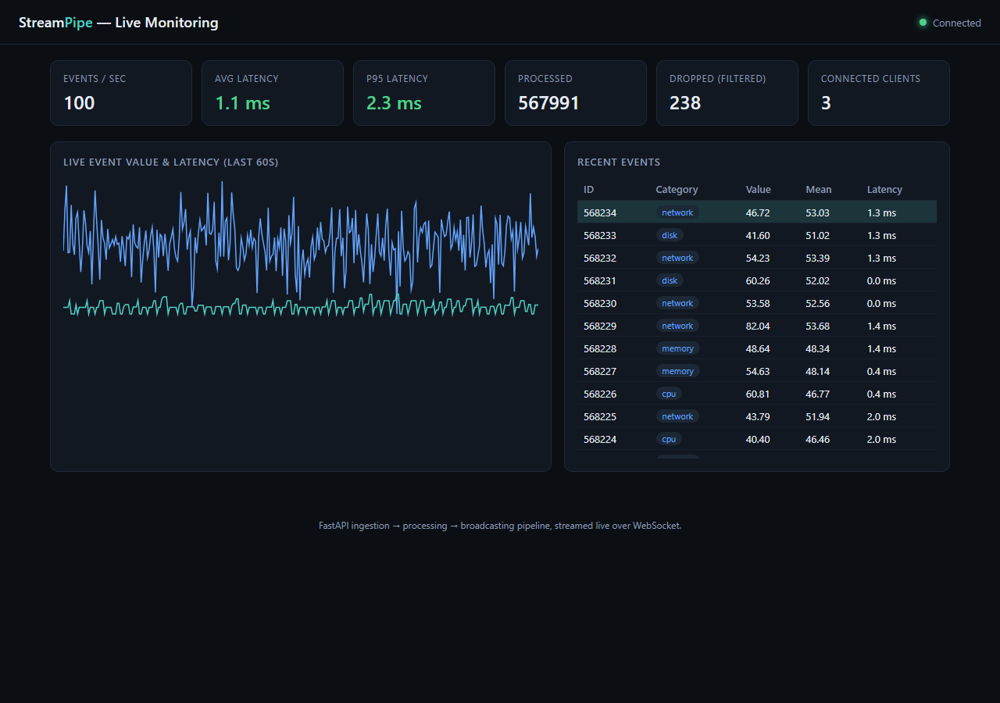
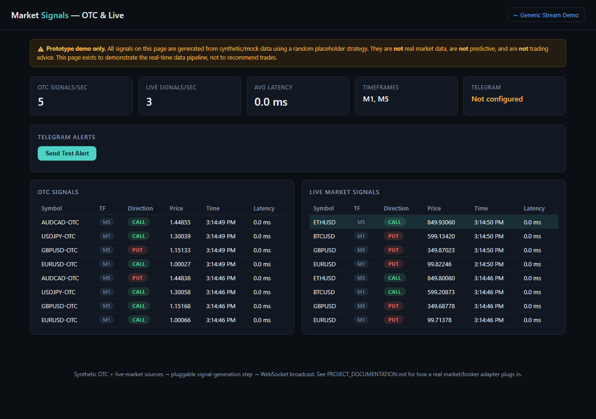

# Python Web Stream Processing

A real-time stream processing pipeline: a synthetic event source is
ingested, filtered/aggregated/enriched on the fly, and broadcast over
WebSocket to a live monitoring dashboard.



```
┌────────────┐    asyncio.Queue    ┌────────────┐    WebSocket    ┌──────────┐
│ Ingestion  │ ──────────────────▶ │ Processing │ ──────────────▶ │ Browser  │
│ (demo gen  │                     │  Pipeline  │   broadcast     │ dashboard│
│  or POST   │                     │ filter →   │                 │          │
│  /ingest)  │                     │ aggregate →│                 │          │
└────────────┘                     │ enrich     │                 └──────────┘
                                    └────────────┘
```

- **Ingestion** (`app/ingestion/`): a synthetic generator (`DemoEventSource`) produces
  ~100 events/sec out of the box, or external producers can `POST /ingest`. Both
  feed the same internal queue, so swapping in a Kafka or MQTT consumer later
  just means writing one more class that implements `EventSource` — nothing
  downstream changes.
- **Processing** (`app/processing/`): a composable `Pipeline` of steps —
  `threshold_filter` (filtering), `RollingAggregateStep` (per-category
  rolling mean/stdev — aggregation), `enrich_step` (adds processing
  timestamp + latency — enrichment).
- **Broadcasting** (`app/broadcasting/`): `ConnectionManager` fans processed
  events out to every connected WebSocket client and prunes dead ones.
- **Dashboard** (`client/`): a dependency-free HTML/JS page showing live
  events/sec, average & p95 latency, a rolling value/latency chart, and a
  live event table.

A second prototype — a **market signals dashboard** (OTC + live, with
Telegram alerts) — is built on the same architecture. It's a separate demo
page (`client/signals.html`) so the original demo above is untouched; see
[PROJECT_DOCUMENTATION.md](PROJECT_DOCUMENTATION.md) for the full picture.
**All signals are synthetic/mock data — not real market data, not trading
advice.**



## Quick start (Docker)

```bash
docker compose up --build
```

Then open **http://localhost:8000** — the dashboard connects automatically
and you'll see the built-in demo generator streaming ~100 events/sec.
Open **http://localhost:8000/signals.html** for the market signals demo.

## Quick start (local Python)

```bash
python -m venv .venv
.venv\Scripts\activate        # Windows
# source .venv/bin/activate   # macOS/Linux

pip install -r requirements.txt
uvicorn app.main:app --reload
```

Open **http://localhost:8000**.

## Configuration

Environment variables (all optional):

| Variable              | Default | Meaning                                              |
|-----------------------|---------|-------------------------------------------------------|
| `DEMO_SOURCE_ENABLED` | `true`  | Run the built-in synthetic generator                  |
| `DEMO_SOURCE_RATE`    | `100`   | Events/sec produced by the demo generator             |
| `FILTER_MIN_VALUE`    | `0`     | Events below this value are dropped by the pipeline   |
| `QUEUE_MAXSIZE`       | `5000`  | Backpressure limit on the ingestion queue             |

Market signals pipeline (see [PROJECT_DOCUMENTATION.md](PROJECT_DOCUMENTATION.md)
for the full list, Telegram setup, and mock-data details):

| Variable | Default | Meaning |
|---|---|---|
| `OTC_SOURCE_ENABLED` / `LIVE_SOURCE_ENABLED` | `true` | Enable each mock signal source |
| `OTC_SYMBOLS` / `LIVE_SYMBOLS` | see docs | Comma-separated symbol lists |
| `SIGNAL_TIMEFRAMES` | `M1,M5` | Comma-separated timeframes signals rotate through |
| `TELEGRAM_BOT_TOKEN` / `TELEGRAM_CHAT_ID` | unset | Enables the "Send Test Alert" button |

## API

- `GET /health` — status, connected client count, queue depth, and
  ingested/processed/dropped/events-per-second counters.
- `POST /ingest` — push a raw event (JSON body) into the pipeline. Used by
  the load test script, and the integration point for a future Kafka/MQTT
  bridge.
- `WS /ws` — subscribe to the live stream of processed events.
- `GET /signals/health`, `POST /signals/ingest`, `WS /ws/signals` — the
  same shape of endpoints for the market signals pipeline.
- `POST /telegram/test-alert` — sends a test message via the configured
  Telegram bot/channel; used by the dashboard's test-alert button.

## Tests

```bash
pytest
```

Covers the filter/aggregate/enrich steps, pipeline chaining and
short-circuiting, the WebSocket connection manager (fan-out + dead
connection pruning), an API smoke test asserting an ingested event comes
back out over `/ws` fully processed, plus the signal-generation step, the
Telegram notifier (no real network calls made in tests), and the
`/signals/*` endpoints. 31 tests in total.

## Load test (100 events/sec, latency check)

With the server running (disable the demo generator first so latency
numbers aren't mixed with its output):

```bash
# terminal 1
set DEMO_SOURCE_ENABLED=false        # PowerShell: $env:DEMO_SOURCE_ENABLED="false"
uvicorn app.main:app

# terminal 2
python scripts/load_test.py --rate 100 --duration 10
```

The script posts ~100 events/sec to `/ingest`, listens on `/ws`, and
reports avg/p50/p95/p99 end-to-end latency (client send → processed
broadcast), asserting the p95 stays under 200ms.

## Deploying for a quick client demo

**Fastest path — Cloudflare Tunnel, no account needed for a temporary link:**

```bash
docker compose up -d --build
cloudflared tunnel --url http://localhost:8000
```

This prints a public `https://*.trycloudflare.com` URL you can send
straight to the client — traffic is proxied through Cloudflare to your
local container, including the WebSocket connection.

**For a persistent URL:** push this repo to GitHub, deploy the container
(Docker image) to any host that runs long-lived processes with WebSocket
support (Fly.io, Railway, a small VPS, etc.), then point a Cloudflare DNS
record at it (proxied, with WebSockets enabled — on by default).
Cloudflare Pages is not suitable on its own since it doesn't run a Python
process — it only fronts a container running elsewhere.

## Swapping in a real source later

Implement `EventSource` (see `app/ingestion/base.py`) for your Kafka
consumer or MQTT client, have it push events onto the same
`event_queue` used in `app/main.py`, and start it in the `lifespan`
context manager alongside/instead of `DemoEventSource`. The processing
and broadcasting layers require no changes.

For the market signals pipeline, the equivalent extension point is
`MarketDataAdapter` (`app/ingestion/market_adapter.py`) — see
[PROJECT_DOCUMENTATION.md](PROJECT_DOCUMENTATION.md) for details. No
scraping or real-broker integration is included in this prototype.
